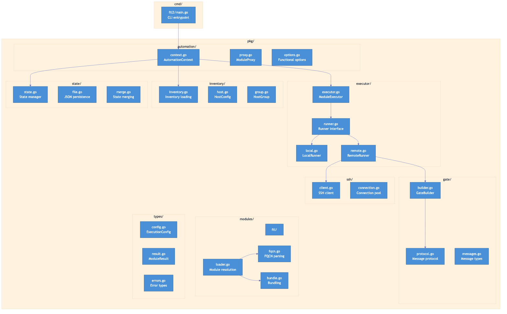
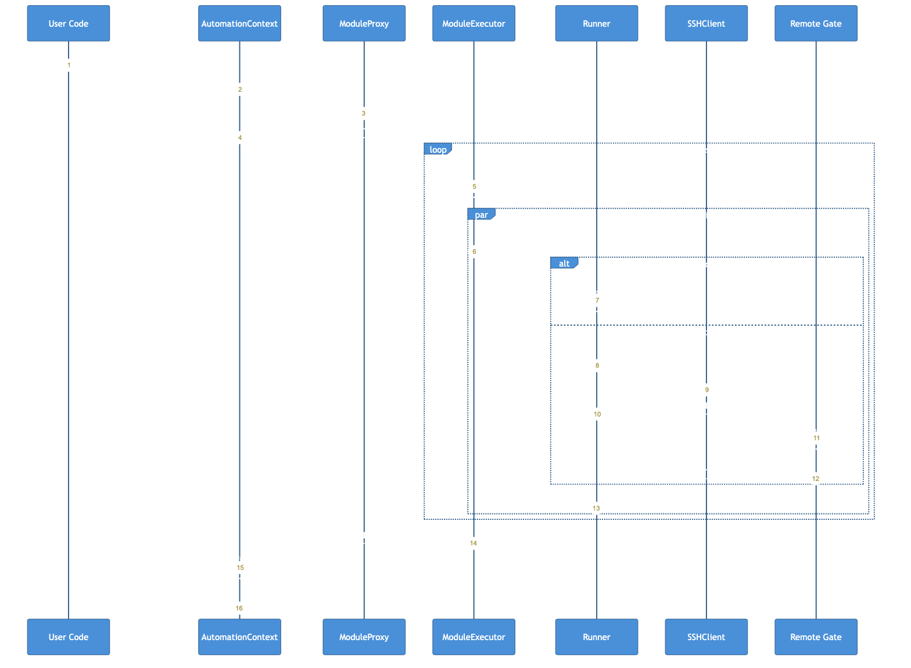

# Go-FTL2 Architecture Overview

This document describes the architecture for the Go port of FTL2 (Faster Than Light v2), a high-performance automation framework.

## What is FTL2?

FTL2 is a Python automation framework that runs Ansible modules in-process instead of as subprocesses, achieving 3-17x speedup over traditional `ansible-playbook`. The Go port aims to provide:

- **Native performance**: Go's compiled nature and efficient concurrency model
- **Single binary distribution**: No Python runtime dependencies
- **Cross-platform support**: Easy compilation for different OS/architectures
- **Memory efficiency**: Lower memory footprint than Python

## Architecture Diagram



## Core Design Principles

### 1. Interface-Driven Design

Go interfaces replace Python's abstract base classes and duck typing:

```go
// Runner executes modules on a host
type Runner interface {
    Run(ctx context.Context, host *Host, module string, args map[string]any) (*ModuleResult, error)
}
```

### 2. Functional Options Pattern

Configuration uses the functional options pattern for clean, extensible APIs:

```go
ctx, err := automation.New(
    automation.WithInventory("inventory.yaml"),
    automation.WithSecrets("AWS_ACCESS_KEY", "AWS_SECRET_KEY"),
    automation.WithChunkSize(10),
    automation.WithFailFast(true),
)
```

### 3. Context-Based Cancellation

All operations accept `context.Context` for timeout and cancellation:

```go
ctx, cancel := context.WithTimeout(context.Background(), 5*time.Minute)
defer cancel()

results, err := ftl.Execute(ctx, "webservers", "dnf", map[string]any{"name": "nginx"})
```

### 4. Explicit Error Handling

Go's explicit error handling replaces Python exceptions:

```go
result, err := runner.Run(ctx, host, module, args)
if err != nil {
    if errors.Is(err, ErrConnectionFailed) {
        // Handle connection failure
    }
    return nil, fmt.Errorf("module execution failed: %w", err)
}
```

## High-Level Components

| Component | Responsibility |
|-----------|---------------|
| `automation` | User-facing API, context management |
| `executor` | Concurrent execution orchestration |
| `inventory` | Host and group management |
| `state` | Persistent state tracking |
| `gate` | Remote execution protocol |
| `ssh` | SSH connection management |
| `modules` | Module resolution and loading |
| `types` | Shared type definitions |

## Execution Flow



1. User calls `Execute()` with target hosts and module
2. `ModuleProxy` resolves target to actual hosts
3. `ModuleExecutor` chunks hosts for concurrent processing
4. For each host, appropriate `Runner` is selected (local/remote)
5. Remote hosts use SSH to deploy and communicate with the gate
6. Results are collected, secrets filtered, and returned

## Key Differences from Python Version

| Aspect | Python FTL2 | Go FTL2 |
|--------|-------------|---------|
| Concurrency | asyncio | goroutines + channels |
| Module syntax | `ftl.webservers.dnf()` | `ftl.Execute("webservers", "dnf", args)` |
| Configuration | Dataclasses | Structs + functional options |
| Error handling | Exceptions | Explicit error returns |
| Dependencies | pip packages | Go modules (vendored) |
| Distribution | Python package | Single binary |

## Document Index

1. [Package Structure](01-package-structure.md) - Directory layout and packages
2. [Core Types](02-core-types.md) - Type definitions and interfaces
3. [Execution Engine](03-execution-engine.md) - Concurrency model and execution
4. [Gate Protocol](04-gate-protocol.md) - Remote execution protocol
5. [Module System](05-module-system.md) - Module resolution and loading
6. [State Management](06-state-management.md) - Persistent state tracking
7. [Implementation Roadmap](07-implementation-roadmap.md) - Phased implementation plan
