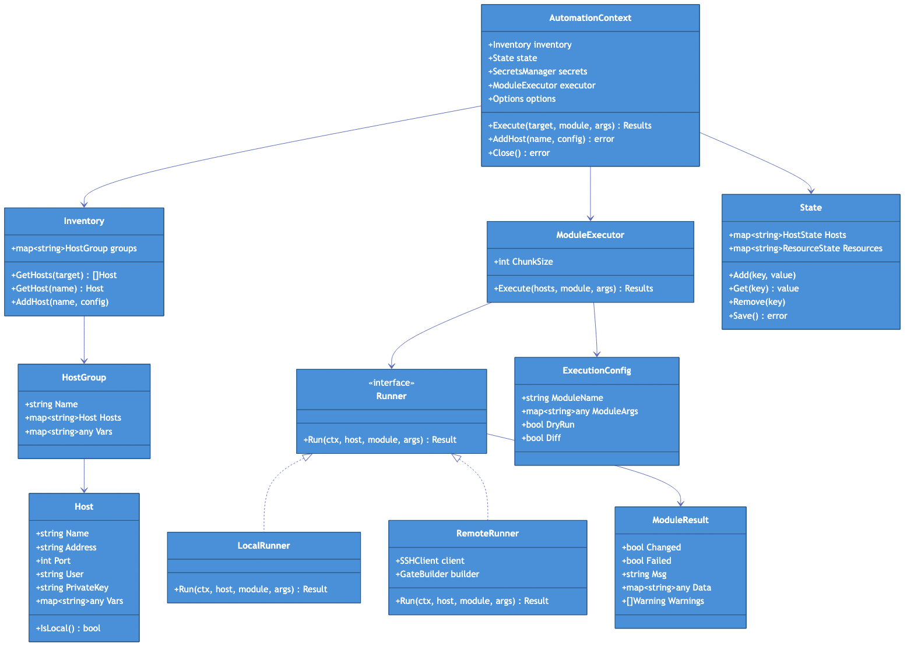

# Core Types

This document defines the core type system for Go-FTL2.

## Type Hierarchy Diagram



## Configuration Types

### AutomationContext

The main orchestration context:

```go
package automation

type Context struct {
    // Core components
    inventory *inventory.Inventory
    state     *state.State
    executor  *executor.Executor
    secrets   *secrets.Manager

    // Configuration
    options   Options

    // Internal state
    mu        sync.RWMutex
    closed    bool
    auditLog  *os.File
}

type Options struct {
    InventoryPath   string
    StatePath       string
    AuditPath       string
    ChunkSize       int
    FailFast        bool
    DryRun          bool
    Verbose         bool
    Quiet           bool
    Secrets         []string
    SecretBindings  map[string]map[string]string
    GateModules     []string
}
```

### Functional Options

```go
package automation

type Option func(*Options)

func WithInventory(path string) Option {
    return func(o *Options) {
        o.InventoryPath = path
    }
}

func WithInventoryData(data map[string]any) Option {
    return func(o *Options) {
        o.InventoryData = data
    }
}

func WithState(path string) Option {
    return func(o *Options) {
        o.StatePath = path
    }
}

func WithSecrets(names ...string) Option {
    return func(o *Options) {
        o.Secrets = append(o.Secrets, names...)
    }
}

func WithSecretBindings(bindings map[string]map[string]string) Option {
    return func(o *Options) {
        o.SecretBindings = bindings
    }
}

func WithChunkSize(size int) Option {
    return func(o *Options) {
        o.ChunkSize = size
    }
}

func WithFailFast(enabled bool) Option {
    return func(o *Options) {
        o.FailFast = enabled
    }
}

func WithDryRun(enabled bool) Option {
    return func(o *Options) {
        o.DryRun = enabled
    }
}

func WithAuditLog(path string) Option {
    return func(o *Options) {
        o.AuditPath = path
    }
}

func WithGateModules(modules ...string) Option {
    return func(o *Options) {
        o.GateModules = append(o.GateModules, modules...)
    }
}
```

## Inventory Types

### Host

```go
package inventory

// Host represents a target machine for automation
type Host struct {
    // Identity
    Name string `yaml:"name" json:"name"`

    // Connection
    Address    string `yaml:"ansible_host" json:"ansible_host"`
    Port       int    `yaml:"ansible_port" json:"ansible_port"`
    User       string `yaml:"ansible_user" json:"ansible_user"`
    PrivateKey string `yaml:"ansible_ssh_private_key_file" json:"ansible_ssh_private_key_file,omitempty"`

    // Host-specific variables
    Vars map[string]any `yaml:"vars" json:"vars,omitempty"`

    // Internal
    group *HostGroup
}

// IsLocal returns true if this host represents localhost
func (h *Host) IsLocal() bool {
    return h.Address == "localhost" || h.Address == "127.0.0.1" || h.Name == "localhost"
}

// SSHAddress returns the host:port for SSH connection
func (h *Host) SSHAddress() string {
    port := h.Port
    if port == 0 {
        port = 22
    }
    return fmt.Sprintf("%s:%d", h.Address, port)
}

// GetVar retrieves a variable, checking host vars then group vars
func (h *Host) GetVar(key string) (any, bool) {
    if v, ok := h.Vars[key]; ok {
        return v, true
    }
    if h.group != nil {
        return h.group.GetVar(key)
    }
    return nil, false
}
```

### HostGroup

```go
package inventory

// HostGroup is a named collection of hosts
type HostGroup struct {
    Name     string              `yaml:"name" json:"name"`
    Hosts    map[string]*Host    `yaml:"hosts" json:"hosts"`
    Vars     map[string]any      `yaml:"vars" json:"vars,omitempty"`
    Children []*HostGroup        `yaml:"children" json:"children,omitempty"`
}

// GetVar retrieves a group variable
func (g *HostGroup) GetVar(key string) (any, bool) {
    v, ok := g.Vars[key]
    return v, ok
}

// AllHosts returns all hosts including from child groups
func (g *HostGroup) AllHosts() []*Host {
    hosts := make([]*Host, 0, len(g.Hosts))
    for _, h := range g.Hosts {
        hosts = append(hosts, h)
    }
    for _, child := range g.Children {
        hosts = append(hosts, child.AllHosts()...)
    }
    return hosts
}
```

### Inventory

```go
package inventory

// Inventory holds all hosts and groups
type Inventory struct {
    groups map[string]*HostGroup
    hosts  map[string]*Host // flat lookup
}

// Load parses an inventory file
func Load(path string) (*Inventory, error)

// LoadFromData parses inventory from a map
func LoadFromData(data map[string]any) (*Inventory, error)

// GetHosts returns hosts matching the target pattern
func (i *Inventory) GetHosts(target string) ([]*Host, error)

// GetHost returns a single host by name
func (i *Inventory) GetHost(name string) (*Host, bool)

// GetGroup returns a group by name
func (i *Inventory) GetGroup(name string) (*HostGroup, bool)

// AddHost adds a host to the inventory
func (i *Inventory) AddHost(groupName string, host *Host) error

// AllHosts returns all hosts in the inventory
func (i *Inventory) AllHosts() []*Host
```

## Execution Types

### ExecutionConfig

```go
package types

// ExecutionConfig holds parameters for module execution
type ExecutionConfig struct {
    ModuleName string         `json:"module_name"`
    ModuleArgs map[string]any `json:"module_args"`
    DryRun     bool           `json:"check_mode"`
    Diff       bool           `json:"diff"`
}
```

### ModuleResult

```go
package types

// ModuleResult is the outcome of a single module execution
type ModuleResult struct {
    // Status
    Changed bool `json:"changed"`
    Failed  bool `json:"failed"`
    Skipped bool `json:"skipped,omitempty"`

    // Message
    Msg string `json:"msg,omitempty"`

    // Module-specific data
    Data map[string]any `json:"data,omitempty"`

    // Diagnostics
    Warnings []string `json:"warnings,omitempty"`
    Stderr   string   `json:"stderr,omitempty"`
    Stdout   string   `json:"stdout,omitempty"`

    // Diff (when diff mode enabled)
    Diff *Diff `json:"diff,omitempty"`

    // Timing
    StartTime time.Time     `json:"start_time"`
    Duration  time.Duration `json:"duration"`
}

// Diff represents before/after state
type Diff struct {
    Before string `json:"before"`
    After  string `json:"after"`
}

// IsSuccess returns true if the module completed without failure
func (r *ModuleResult) IsSuccess() bool {
    return !r.Failed
}
```

### ExecutionResults

```go
package types

// ExecutionResults aggregates results across multiple hosts
type ExecutionResults struct {
    // Per-host results
    Results map[string]*ModuleResult `json:"results"`

    // Summary
    Successful int `json:"successful"`
    Failed     int `json:"failed"`
    Changed    int `json:"changed"`
    Skipped    int `json:"skipped"`

    // Timing
    StartTime time.Time     `json:"start_time"`
    Duration  time.Duration `json:"duration"`
}

// HasFailures returns true if any host failed
func (r *ExecutionResults) HasFailures() bool {
    return r.Failed > 0
}

// FailedHosts returns the names of hosts that failed
func (r *ExecutionResults) FailedHosts() []string {
    var hosts []string
    for name, result := range r.Results {
        if result.Failed {
            hosts = append(hosts, name)
        }
    }
    return hosts
}
```

## Interface Definitions

### Runner

```go
package executor

// Runner executes a module on a single host
type Runner interface {
    // Run executes the module and returns the result
    Run(ctx context.Context, host *inventory.Host, config *types.ExecutionConfig) (*types.ModuleResult, error)

    // Close releases any resources held by the runner
    Close() error
}
```

### FTLModule

```go
package modules

// FTLModule is a native Go module implementation
type FTLModule interface {
    // Name returns the module name (e.g., "ftl_file")
    Name() string

    // Run executes the module with the given arguments
    Run(ctx context.Context, args map[string]any) (*types.ModuleResult, error)
}
```

### StateBackend

```go
package state

// Backend is the storage interface for state
type Backend interface {
    // Load reads state from storage
    Load() (*State, error)

    // Save writes state to storage
    Save(s *State) error
}

// FileBackend stores state in a JSON file
type FileBackend struct {
    path string
}
```

## Error Types

```go
package types

// Sentinel errors
var (
    ErrHostNotFound      = errors.New("host not found")
    ErrGroupNotFound     = errors.New("group not found")
    ErrModuleNotFound    = errors.New("module not found")
    ErrConnectionFailed  = errors.New("connection failed")
    ErrExecutionFailed   = errors.New("execution failed")
    ErrContextCanceled   = errors.New("context canceled")
    ErrInvalidInventory  = errors.New("invalid inventory")
    ErrInvalidState      = errors.New("invalid state")
)

// ModuleError wraps module execution errors with context
type ModuleError struct {
    Host   string
    Module string
    Err    error
}

func (e *ModuleError) Error() string {
    return fmt.Sprintf("module %s failed on %s: %v", e.Module, e.Host, e.Err)
}

func (e *ModuleError) Unwrap() error {
    return e.Err
}

// ConnectionError wraps SSH connection errors
type ConnectionError struct {
    Host string
    Err  error
}

func (e *ConnectionError) Error() string {
    return fmt.Sprintf("failed to connect to %s: %v", e.Host, e.Err)
}

func (e *ConnectionError) Unwrap() error {
    return e.Err
}
```

## JSON Serialization

All types use standard Go JSON tags for serialization. The gate protocol and state files use JSON encoding:

```go
// Encoding
data, err := json.Marshal(result)

// Decoding
var result types.ModuleResult
err := json.Unmarshal(data, &result)
```

For YAML (inventory files):

```go
import "gopkg.in/yaml.v3"

// Encoding
data, err := yaml.Marshal(inventory)

// Decoding
var inv map[string]any
err := yaml.Unmarshal(data, &inv)
```
