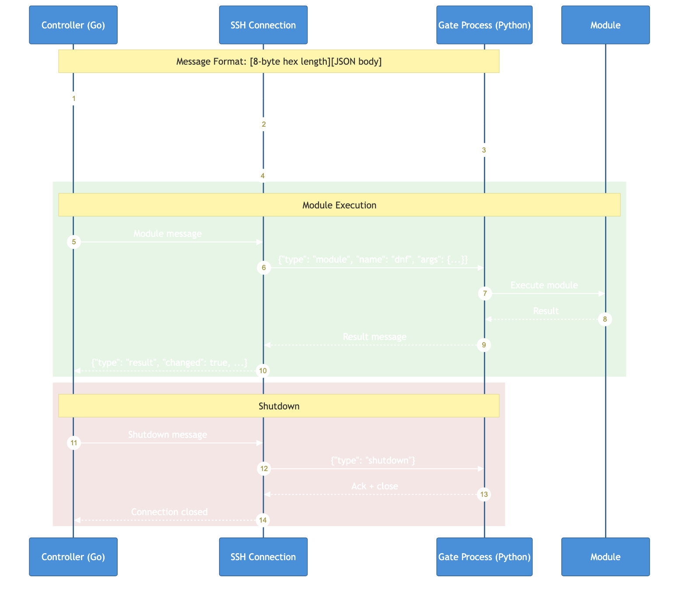

# Gate Protocol

This document describes the remote execution protocol between Go-FTL2 and the Python gate process.

## Protocol Diagram



## Overview

The gate is a Python zipapp (`.pyz` file) that runs on remote hosts. It:

1. Receives commands via stdin (length-prefixed JSON)
2. Executes Ansible/FTL modules
3. Returns results via stdout (length-prefixed JSON)

The Go controller communicates with the gate over SSH stdin/stdout.

## Message Format

All messages use length-prefixed JSON encoding:

```
[8-byte hex length][JSON body]
```

Example:
```
0000002b{"type":"hello","version":"1.0","pid":12345}
```

The length is the hex-encoded byte length of the JSON body, zero-padded to 8 characters.

## Protocol Implementation

### Message Encoding/Decoding

```go
package gate

import (
    "encoding/hex"
    "encoding/json"
    "fmt"
    "io"
)

const LengthPrefixSize = 8

// Protocol handles message encoding/decoding
type Protocol struct {
    reader io.Reader
    writer io.Writer
}

func NewProtocol(r io.Reader, w io.Writer) *Protocol {
    return &Protocol{reader: r, writer: w}
}

// Send encodes and writes a message
func (p *Protocol) Send(msg any) error {
    body, err := json.Marshal(msg)
    if err != nil {
        return fmt.Errorf("failed to marshal message: %w", err)
    }

    // Create length prefix
    lengthHex := fmt.Sprintf("%08x", len(body))

    // Write length prefix
    if _, err := p.writer.Write([]byte(lengthHex)); err != nil {
        return fmt.Errorf("failed to write length prefix: %w", err)
    }

    // Write body
    if _, err := p.writer.Write(body); err != nil {
        return fmt.Errorf("failed to write body: %w", err)
    }

    return nil
}

// Receive reads and decodes a message
func (p *Protocol) Receive() (map[string]any, error) {
    // Read length prefix
    prefix := make([]byte, LengthPrefixSize)
    if _, err := io.ReadFull(p.reader, prefix); err != nil {
        if err == io.EOF {
            return nil, err
        }
        return nil, fmt.Errorf("failed to read length prefix: %w", err)
    }

    // Parse length
    length, err := hex.DecodeString(string(prefix))
    if err != nil {
        return nil, fmt.Errorf("invalid length prefix: %w", err)
    }

    bodyLen := int(length[0])<<24 | int(length[1])<<16 | int(length[2])<<8 | int(length[3])

    // Read body
    body := make([]byte, bodyLen)
    if _, err := io.ReadFull(p.reader, body); err != nil {
        return nil, fmt.Errorf("failed to read body: %w", err)
    }

    // Parse JSON
    var msg map[string]any
    if err := json.Unmarshal(body, &msg); err != nil {
        return nil, fmt.Errorf("failed to parse message: %w", err)
    }

    return msg, nil
}
```

## Message Types

### Hello (Gate → Controller)

Sent by the gate immediately after startup:

```go
type HelloMessage struct {
    Type    string `json:"type"`    // "hello"
    Version string `json:"version"` // Protocol version
    PID     int    `json:"pid"`     // Gate process ID
}
```

```json
{"type": "hello", "version": "1.0", "pid": 12345}
```

### Module (Controller → Gate)

Request to execute a module:

```go
type ModuleMessage struct {
    Type      string         `json:"type"`       // "module"
    Name      string         `json:"name"`       // Module name (e.g., "dnf", "ansible.builtin.copy")
    Args      map[string]any `json:"args"`       // Module arguments
    CheckMode bool           `json:"check_mode"` // Dry-run mode
}
```

```json
{
    "type": "module",
    "name": "dnf",
    "args": {
        "name": "nginx",
        "state": "present"
    },
    "check_mode": false
}
```

### FTL Module (Controller → Gate)

Request to execute a native FTL module:

```go
type FTLModuleMessage struct {
    Type      string         `json:"type"`       // "ftl_module"
    Name      string         `json:"name"`       // FTL module name (e.g., "ftl_file")
    Args      map[string]any `json:"args"`       // Module arguments
    CheckMode bool           `json:"check_mode"` // Dry-run mode
}
```

### Result (Gate → Controller)

Module execution result:

```go
type ResultMessage struct {
    Type     string         `json:"type"`              // "result"
    Changed  bool           `json:"changed"`
    Failed   bool           `json:"failed"`
    Msg      string         `json:"msg,omitempty"`
    Data     map[string]any `json:"data,omitempty"`
    Warnings []string       `json:"warnings,omitempty"`
    Diff     *DiffData      `json:"diff,omitempty"`
}

type DiffData struct {
    Before string `json:"before"`
    After  string `json:"after"`
}
```

```json
{
    "type": "result",
    "changed": true,
    "failed": false,
    "msg": "Package nginx installed",
    "data": {
        "rc": 0,
        "results": ["nginx-1.24.0-1.el9.x86_64"]
    }
}
```

### Event (Gate → Controller)

Progress/logging event:

```go
type EventMessage struct {
    Type    string `json:"type"`    // "event"
    Event   string `json:"event"`   // Event type: "progress", "log", etc.
    Message string `json:"message"` // Event message
}
```

### Shutdown (Controller → Gate)

Request to terminate the gate:

```go
type ShutdownMessage struct {
    Type string `json:"type"` // "shutdown"
}
```

### Info (Controller → Gate)

Request for gate information:

```go
type InfoMessage struct {
    Type string `json:"type"` // "info"
}
```

Response:

```go
type InfoResponse struct {
    Type         string   `json:"type"`          // "info_response"
    Version      string   `json:"version"`       // Gate version
    PythonPath   string   `json:"python_path"`   // Python interpreter path
    Modules      []string `json:"modules"`       // Available modules
    FTLModules   []string `json:"ftl_modules"`   // Available FTL modules
}
```

## Gate Connection

```go
package gate

import (
    "context"
    "sync"
)

// Connection manages communication with a gate process
type Connection struct {
    protocol *Protocol
    sshConn  *ssh.Connection
    mu       sync.Mutex
    closed   bool
}

func NewConnection(
    ctx context.Context,
    sshConn *ssh.Connection,
    gatePath string,
) (*Connection, error) {
    // Start the gate process
    session, err := sshConn.NewSession()
    if err != nil {
        return nil, fmt.Errorf("failed to create session: %w", err)
    }

    stdin, err := session.StdinPipe()
    if err != nil {
        return nil, fmt.Errorf("failed to get stdin: %w", err)
    }

    stdout, err := session.StdoutPipe()
    if err != nil {
        return nil, fmt.Errorf("failed to get stdout: %w", err)
    }

    // Start the gate
    cmd := fmt.Sprintf("python3 %s", gatePath)
    if err := session.Start(cmd); err != nil {
        return nil, fmt.Errorf("failed to start gate: %w", err)
    }

    conn := &Connection{
        protocol: NewProtocol(stdout, stdin),
        sshConn:  sshConn,
    }

    // Wait for hello message
    hello, err := conn.protocol.Receive()
    if err != nil {
        return nil, fmt.Errorf("failed to receive hello: %w", err)
    }

    if hello["type"] != "hello" {
        return nil, fmt.Errorf("unexpected message type: %v", hello["type"])
    }

    return conn, nil
}

// SendModule sends a module execution request and waits for the result
func (c *Connection) SendModule(
    ctx context.Context,
    msg *ModuleMessage,
) (*types.ModuleResult, error) {
    c.mu.Lock()
    defer c.mu.Unlock()

    if c.closed {
        return nil, errors.New("connection closed")
    }

    // Send module message
    if err := c.protocol.Send(msg); err != nil {
        return nil, err
    }

    // Read response
    resp, err := c.protocol.Receive()
    if err != nil {
        return nil, err
    }

    // Handle events while waiting for result
    for resp["type"] == "event" {
        // Log or handle event
        resp, err = c.protocol.Receive()
        if err != nil {
            return nil, err
        }
    }

    if resp["type"] != "result" {
        return nil, fmt.Errorf("unexpected response type: %v", resp["type"])
    }

    // Convert to ModuleResult
    result := &types.ModuleResult{
        Changed: resp["changed"].(bool),
        Failed:  resp["failed"].(bool),
    }

    if msg, ok := resp["msg"].(string); ok {
        result.Msg = msg
    }
    if data, ok := resp["data"].(map[string]any); ok {
        result.Data = data
    }
    if warnings, ok := resp["warnings"].([]any); ok {
        for _, w := range warnings {
            result.Warnings = append(result.Warnings, w.(string))
        }
    }

    return result, nil
}

// Shutdown terminates the gate process
func (c *Connection) Shutdown() error {
    c.mu.Lock()
    defer c.mu.Unlock()

    if c.closed {
        return nil
    }

    c.closed = true

    // Send shutdown message
    if err := c.protocol.Send(&ShutdownMessage{Type: "shutdown"}); err != nil {
        // Ignore errors on shutdown
    }

    return c.sshConn.Close()
}
```

## Gate Builder

```go
package gate

import (
    "crypto/sha256"
    "os"
    "path/filepath"
)

// Builder creates and caches gate executables
type Builder struct {
    cacheDir string
    modules  []string
    hash     string
}

func NewBuilder(cacheDir string, modules []string) *Builder {
    return &Builder{
        cacheDir: cacheDir,
        modules:  modules,
    }
}

// Build creates the gate executable, using cache if available
func (b *Builder) Build(ctx context.Context) (string, error) {
    hash := b.computeHash()
    gatePath := filepath.Join(b.cacheDir, fmt.Sprintf("gate-%s.pyz", hash))

    // Check cache
    if _, err := os.Stat(gatePath); err == nil {
        b.hash = hash
        return gatePath, nil
    }

    // Build new gate
    if err := b.buildGate(ctx, gatePath); err != nil {
        return "", err
    }

    b.hash = hash
    return gatePath, nil
}

func (b *Builder) computeHash() string {
    h := sha256.New()

    // Hash gate source
    h.Write(gateSource)

    // Hash modules
    for _, mod := range b.modules {
        h.Write([]byte(mod))
    }

    return fmt.Sprintf("%x", h.Sum(nil))[:16]
}

func (b *Builder) buildGate(ctx context.Context, outputPath string) error {
    // Create temporary directory
    tmpDir, err := os.MkdirTemp("", "gate-build-")
    if err != nil {
        return err
    }
    defer os.RemoveAll(tmpDir)

    // Write gate source
    mainPath := filepath.Join(tmpDir, "__main__.py")
    if err := os.WriteFile(mainPath, gateSource, 0644); err != nil {
        return err
    }

    // Bundle modules
    for _, mod := range b.modules {
        // Copy module to tmpDir
        // ...
    }

    // Create zipapp
    cmd := exec.CommandContext(ctx, "python3", "-m", "zipapp", tmpDir, "-o", outputPath)
    if err := cmd.Run(); err != nil {
        return fmt.Errorf("failed to create zipapp: %w", err)
    }

    return nil
}

func (b *Builder) Hash() string {
    return b.hash
}

// Embedded gate source
var gateSource = []byte(`
# Gate __main__.py - embedded in Go binary
import sys
import json
...
`)
```

## Error Handling

### Protocol Errors

```go
// ProtocolError represents a gate protocol error
type ProtocolError struct {
    Message string
    Raw     []byte
}

func (e *ProtocolError) Error() string {
    return fmt.Sprintf("protocol error: %s", e.Message)
}
```

### Timeout Handling

```go
func (c *Connection) SendModuleWithTimeout(
    ctx context.Context,
    msg *ModuleMessage,
    timeout time.Duration,
) (*types.ModuleResult, error) {
    ctx, cancel := context.WithTimeout(ctx, timeout)
    defer cancel()

    resultCh := make(chan *types.ModuleResult, 1)
    errCh := make(chan error, 1)

    go func() {
        result, err := c.SendModule(ctx, msg)
        if err != nil {
            errCh <- err
            return
        }
        resultCh <- result
    }()

    select {
    case result := <-resultCh:
        return result, nil
    case err := <-errCh:
        return nil, err
    case <-ctx.Done():
        return nil, ctx.Err()
    }
}
```

## Compatibility Notes

The gate protocol is designed for forward compatibility:

1. Unknown message fields are ignored
2. New optional fields can be added without breaking older gates
3. Version negotiation happens in the hello message
4. The Go controller should handle both old and new gate versions
