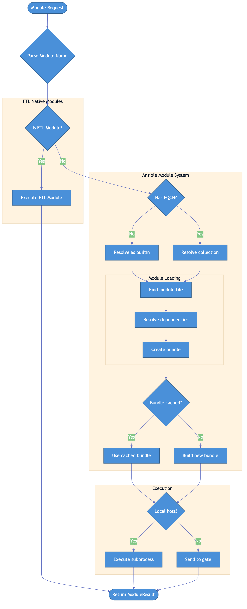

# Module System

This document describes how Go-FTL2 resolves and executes modules.

## Module Resolution Diagram



## Overview

Go-FTL2 supports three types of modules:

1. **FTL Modules** - Native Go implementations (fastest)
2. **Ansible Builtin Modules** - Standard Ansible modules
3. **Collection Modules** - Community/vendor modules via FQCN

## Module Resolution Order

```
1. Check FTL module registry (native Go)
2. Check if FQCN format (namespace.collection.module)
3. Resolve as ansible.builtin.X
4. Check excluded modules (block for safety)
5. Find module file in search paths
6. Bundle dependencies if needed
```

## FTL Modules

Native Go implementations of common modules for maximum performance.

### FTL Module Interface

```go
package modules

// FTLModule is a native Go module implementation
type FTLModule interface {
    // Name returns the module name (e.g., "ftl_file")
    Name() string

    // Run executes the module
    Run(ctx context.Context, args map[string]any) (*types.ModuleResult, error)
}
```

### FTL Module Registry

```go
package modules

var ftlModules = map[string]FTLModule{}

// RegisterFTLModule adds a module to the registry
func RegisterFTLModule(m FTLModule) {
    ftlModules[m.Name()] = m
}

// GetFTLModule retrieves a module by name
func GetFTLModule(name string) (FTLModule, bool) {
    m, ok := ftlModules[name]
    return m, ok
}

func init() {
    RegisterFTLModule(&FileModule{})
    RegisterFTLModule(&CommandModule{})
    RegisterFTLModule(&CopyModule{})
    RegisterFTLModule(&URIModule{})
    RegisterFTLModule(&GetURLModule{})
}
```

### Example: File Module

```go
package ftl

import (
    "context"
    "os"
    "path/filepath"
)

type FileModule struct{}

func (m *FileModule) Name() string {
    return "ftl_file"
}

func (m *FileModule) Run(ctx context.Context, args map[string]any) (*types.ModuleResult, error) {
    path, _ := args["path"].(string)
    state, _ := args["state"].(string)
    mode, _ := args["mode"].(string)
    owner, _ := args["owner"].(string)
    group, _ := args["group"].(string)

    if path == "" {
        return &types.ModuleResult{
            Failed: true,
            Msg:    "path is required",
        }, nil
    }

    switch state {
    case "directory":
        return m.ensureDirectory(ctx, path, mode)
    case "file":
        return m.ensureFile(ctx, path, mode, owner, group)
    case "absent":
        return m.ensureAbsent(ctx, path)
    case "touch":
        return m.touch(ctx, path, mode)
    case "link":
        src, _ := args["src"].(string)
        return m.ensureLink(ctx, path, src)
    default:
        return m.stat(ctx, path)
    }
}

func (m *FileModule) ensureDirectory(ctx context.Context, path, mode string) (*types.ModuleResult, error) {
    info, err := os.Stat(path)
    if err == nil && info.IsDir() {
        return &types.ModuleResult{Changed: false, Msg: "directory exists"}, nil
    }

    perm := os.FileMode(0755)
    if mode != "" {
        // Parse mode string
        // ...
    }

    if err := os.MkdirAll(path, perm); err != nil {
        return &types.ModuleResult{
            Failed: true,
            Msg:    err.Error(),
        }, nil
    }

    return &types.ModuleResult{
        Changed: true,
        Msg:     "directory created",
    }, nil
}

// ... other methods ...
```

### Example: Command Module

```go
package ftl

import (
    "bytes"
    "context"
    "os/exec"
    "strings"
)

type CommandModule struct{}

func (m *CommandModule) Name() string {
    return "ftl_command"
}

func (m *CommandModule) Run(ctx context.Context, args map[string]any) (*types.ModuleResult, error) {
    cmd, _ := args["cmd"].(string)
    chdir, _ := args["chdir"].(string)
    creates, _ := args["creates"].(string)
    removes, _ := args["removes"].(string)

    if cmd == "" {
        return &types.ModuleResult{
            Failed: true,
            Msg:    "cmd is required",
        }, nil
    }

    // Check creates/removes conditions
    if creates != "" {
        if _, err := os.Stat(creates); err == nil {
            return &types.ModuleResult{
                Changed: false,
                Msg:     "skipped, creates exists",
                Skipped: true,
            }, nil
        }
    }

    if removes != "" {
        if _, err := os.Stat(removes); os.IsNotExist(err) {
            return &types.ModuleResult{
                Changed: false,
                Msg:     "skipped, removes does not exist",
                Skipped: true,
            }, nil
        }
    }

    // Parse command
    parts := strings.Fields(cmd)
    command := exec.CommandContext(ctx, parts[0], parts[1:]...)

    if chdir != "" {
        command.Dir = chdir
    }

    var stdout, stderr bytes.Buffer
    command.Stdout = &stdout
    command.Stderr = &stderr

    err := command.Run()

    result := &types.ModuleResult{
        Changed: true,
        Data: map[string]any{
            "cmd":    cmd,
            "stdout": stdout.String(),
            "stderr": stderr.String(),
            "rc":     command.ProcessState.ExitCode(),
        },
    }

    if err != nil {
        result.Failed = true
        result.Msg = err.Error()
    }

    return result, nil
}
```

## FQCN Parsing

Fully Qualified Collection Names are parsed into components:

```go
package modules

import (
    "fmt"
    "strings"
)

// FQCN represents a fully qualified collection name
type FQCN struct {
    Namespace  string // e.g., "ansible", "amazon", "community"
    Collection string // e.g., "builtin", "aws", "general"
    Module     string // e.g., "copy", "ec2_instance", "slack"
}

// ParseFQCN parses a module name into FQCN components
func ParseFQCN(name string) (*FQCN, error) {
    parts := strings.Split(name, ".")

    switch len(parts) {
    case 1:
        // Short name, assume ansible.builtin
        return &FQCN{
            Namespace:  "ansible",
            Collection: "builtin",
            Module:     parts[0],
        }, nil

    case 3:
        return &FQCN{
            Namespace:  parts[0],
            Collection: parts[1],
            Module:     parts[2],
        }, nil

    default:
        return nil, fmt.Errorf("invalid module name: %s", name)
    }
}

// String returns the FQCN as a string
func (f *FQCN) String() string {
    return fmt.Sprintf("%s.%s.%s", f.Namespace, f.Collection, f.Module)
}

// IsBuiltin returns true if this is an ansible.builtin module
func (f *FQCN) IsBuiltin() bool {
    return f.Namespace == "ansible" && f.Collection == "builtin"
}
```

## Module Loader

```go
package modules

import (
    "os"
    "path/filepath"
)

// Loader resolves module names to executable paths
type Loader struct {
    searchPaths  []string
    ftlModules   map[string]FTLModule
    bundleCache  map[string]string // FQCN -> bundle path
    excludedMods map[string]bool
}

func NewLoader(searchPaths []string) *Loader {
    return &Loader{
        searchPaths:  searchPaths,
        ftlModules:   ftlModules,
        bundleCache:  make(map[string]string),
        excludedMods: defaultExcludedModules,
    }
}

// Resolve finds the module and returns execution info
func (l *Loader) Resolve(name string) (*ModuleInfo, error) {
    // Check FTL modules first
    if m, ok := l.ftlModules[name]; ok {
        return &ModuleInfo{
            Name:      name,
            Type:      ModuleTypeFTL,
            FTLModule: m,
        }, nil
    }

    // Check for ftl_ prefix
    if strings.HasPrefix(name, "ftl_") {
        if m, ok := l.ftlModules[name]; ok {
            return &ModuleInfo{
                Name:      name,
                Type:      ModuleTypeFTL,
                FTLModule: m,
            }, nil
        }
    }

    // Parse FQCN
    fqcn, err := ParseFQCN(name)
    if err != nil {
        return nil, err
    }

    // Check excluded
    if l.excludedMods[fqcn.String()] {
        return nil, fmt.Errorf("module %s is excluded for safety", name)
    }

    // Check bundle cache
    if bundlePath, ok := l.bundleCache[fqcn.String()]; ok {
        return &ModuleInfo{
            Name:       fqcn.String(),
            Type:       ModuleTypeAnsible,
            BundlePath: bundlePath,
        }, nil
    }

    // Find module file
    modulePath, err := l.findModule(fqcn)
    if err != nil {
        return nil, err
    }

    return &ModuleInfo{
        Name:       fqcn.String(),
        Type:       ModuleTypeAnsible,
        ModulePath: modulePath,
    }, nil
}

func (l *Loader) findModule(fqcn *FQCN) (string, error) {
    for _, searchPath := range l.searchPaths {
        // Check collection path
        collectionPath := filepath.Join(
            searchPath,
            "ansible_collections",
            fqcn.Namespace,
            fqcn.Collection,
            "plugins",
            "modules",
            fqcn.Module+".py",
        )

        if _, err := os.Stat(collectionPath); err == nil {
            return collectionPath, nil
        }
    }

    return "", &types.ModuleNotFoundError{Module: fqcn.String()}
}

// ModuleInfo contains resolved module information
type ModuleInfo struct {
    Name       string
    Type       ModuleType
    FTLModule  FTLModule
    ModulePath string
    BundlePath string
}

type ModuleType int

const (
    ModuleTypeFTL ModuleType = iota
    ModuleTypeAnsible
)
```

## Module Bundling

For remote execution, modules and their dependencies are bundled:

```go
package modules

import (
    "archive/zip"
    "io"
    "os"
    "path/filepath"
)

// Bundle creates a module bundle for remote execution
type Bundle struct {
    modules      []string
    dependencies []string
    outputPath   string
}

func NewBundle(modules []string, outputPath string) *Bundle {
    return &Bundle{
        modules:    modules,
        outputPath: outputPath,
    }
}

// Build creates the bundle archive
func (b *Bundle) Build(ctx context.Context) error {
    // Create output file
    file, err := os.Create(b.outputPath)
    if err != nil {
        return err
    }
    defer file.Close()

    zw := zip.NewWriter(file)
    defer zw.Close()

    // Add modules
    for _, mod := range b.modules {
        if err := b.addModule(zw, mod); err != nil {
            return fmt.Errorf("failed to add module %s: %w", mod, err)
        }
    }

    // Add dependencies
    for _, dep := range b.dependencies {
        if err := b.addFile(zw, dep); err != nil {
            return fmt.Errorf("failed to add dependency %s: %w", dep, err)
        }
    }

    return nil
}

func (b *Bundle) addModule(zw *zip.Writer, modulePath string) error {
    return b.addFile(zw, modulePath)
}

func (b *Bundle) addFile(zw *zip.Writer, filePath string) error {
    file, err := os.Open(filePath)
    if err != nil {
        return err
    }
    defer file.Close()

    info, err := file.Stat()
    if err != nil {
        return err
    }

    header, err := zip.FileInfoHeader(info)
    if err != nil {
        return err
    }

    header.Name = filepath.Base(filePath)
    header.Method = zip.Deflate

    writer, err := zw.CreateHeader(header)
    if err != nil {
        return err
    }

    _, err = io.Copy(writer, file)
    return err
}
```

## Excluded Modules

Certain modules are excluded for safety:

```go
package modules

var defaultExcludedModules = map[string]bool{
    // Dangerous system operations
    "ansible.builtin.reboot":     true,
    "ansible.builtin.shutdown":   true,

    // Modules requiring special handling
    "ansible.builtin.meta":       true,
    "ansible.builtin.include":    true,
    "ansible.builtin.import":     true,

    // Interactive modules
    "ansible.builtin.pause":      true,
    "ansible.builtin.wait_for":   true,
}

func (l *Loader) IsExcluded(name string) bool {
    fqcn, err := ParseFQCN(name)
    if err != nil {
        return false
    }
    return l.excludedMods[fqcn.String()]
}
```

## Shadowed Modules

Some Ansible modules are shadowed by FTL implementations:

```go
package modules

var shadowedModules = map[string]string{
    "ansible.builtin.file":    "ftl_file",
    "ansible.builtin.copy":    "ftl_copy",
    "ansible.builtin.command": "ftl_command",
    "ansible.builtin.shell":   "ftl_command",
    "ansible.builtin.uri":     "ftl_uri",
    "ansible.builtin.get_url": "ftl_get_url",
}

func (l *Loader) getShadowedModule(name string) (FTLModule, bool) {
    fqcn, err := ParseFQCN(name)
    if err != nil {
        return nil, false
    }

    ftlName, ok := shadowedModules[fqcn.String()]
    if !ok {
        return nil, false
    }

    return l.ftlModules[ftlName], true
}
```
